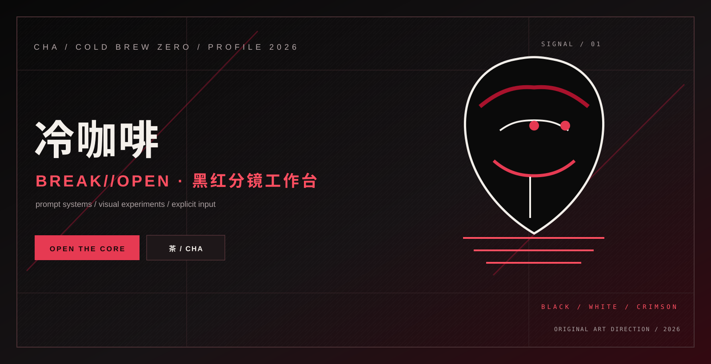

<p align="center">
  
</p>

<h1 align="center">冷咖啡 / ColdBrew Zero</h1>

<p align="center"><strong>破甲思路 · 越界表达 · 本地优先的 BREAK//OPEN 工作台</strong></p>

<p align="center">
  <a href="https://github.com/3641397194-wq/gpt5.6-claude-grok4.6-deepseekv4pro">项目仓库</a>
  &nbsp;·&nbsp;
  <a href="https://github.com/3641397194-wq/gpt5.6-claude-grok4.6-deepseekv4pro#快速运行">快速运行</a>
  &nbsp;·&nbsp;
  <a href="https://github.com/3641397194-wq/gpt5.6-claude-grok4.6-deepseekv4pro#社群入口">社群入口</a>
</p>

## 现在做什么

我在做 ColdBrew Zero：一套从零原创的提示词工作台，把目标锁定、上下文整理、输出生成和检查回看压进一条清晰链路。

- 品牌启动词：`冷咖啡`
- 工作控制词：`BREAK//OPEN`
- 工作方式：`OBJECTIVE -> CONTEXT -> OUTPUT -> CHECK`
- 交付形态：Python CLI + Electron 桌面版

## 代表项目

<p align="center">
  <a href="https://github.com/3641397194-wq/gpt5.6-claude-grok4.6-deepseekv4pro">
    
  </a>
</p>

## 视觉方向

新主页采用“断锁蓝图”系统：深色工程底、青绿信号线、暖金标注、清晰模块和短路径导航。原有产品图、社群宣传图和入口全部保留并重新编排。

## 社群

<table>
  <tr>
    <td align="center" width="50%"><strong>QQ 交流群</strong><br><code>1057540028</code></td>
    <td align="center" width="50%"><strong>QQ 专题群</strong><br><code>1077074552</code></td>
  </tr>
</table>

Telegram 群 [@chachachacha99999](https://t.me/chachachacha99999) &nbsp;·&nbsp; 频道 [@chachachacha99999999](https://t.me/chachachacha99999999)

## 快速开始

```powershell
git clone https://github.com/3641397194-wq/gpt5.6-claude-grok4.6-deepseekv4pro.git
cd gpt5.6-claude-grok4.6-deepseekv4pro
python coldbrew.py --activate 冷咖啡 --profile MAX --prompt "把这段需求拆成可执行步骤"
```

桌面版位于 `desktop/`，主页素材位于 `docs/`。
