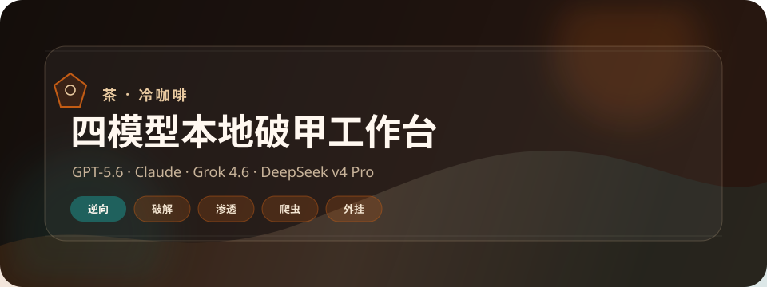
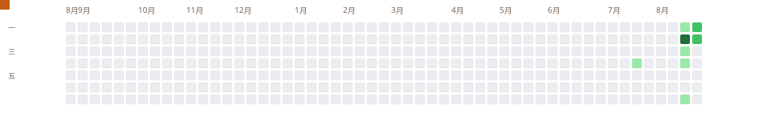
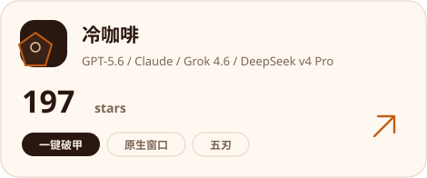
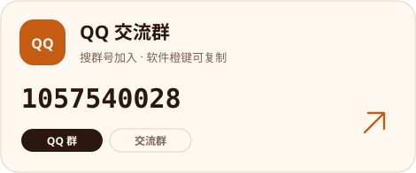
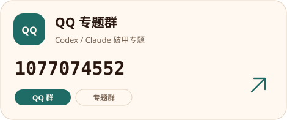

  

  

### Hi, 我是茶

冷咖啡 · 一键破甲越狱。原生窗口作者。口令「冷咖啡」开工。

### GitHub Stats

  

<strong>冷咖啡仓库的 star 会实时刷在这枚金标上</strong>

  

    
    
    
    
  

   

  <picture>
    <source media="(prefers-color-scheme: dark)" srcset="assets/github-contribution-grid-snake-dark.svg" />
    <source media="(prefers-color-scheme: light)" srcset="assets/github-contribution-grid-snake.svg" />
    
  </picture>

### 代表仓库

  

### QQ 群

两个 QQ 群，扫码或搜群号都能进。

<table>
  <tr>
    <td align="center" width="50%">
       
      <strong>QQ 交流群</strong> 
      <code>1057540028</code>
    </td>
    <td align="center" width="50%">
       
      <strong>QQ 专题群</strong> 
      <code>1077074552</code>
    </td>
  </tr>
</table>

Telegram 群 <a href="https://t.me/chachachacha99999"><code>@chachachacha99999</code></a>
&nbsp;·&nbsp;
频道 <a href="https://t.me/chachacha99999999"><code>@chachacha99999999</code></a>

