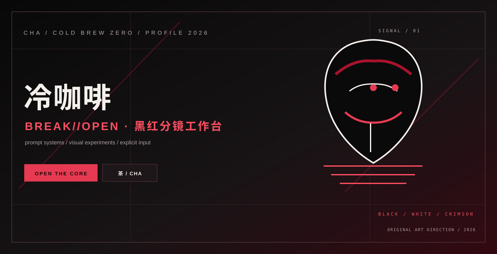
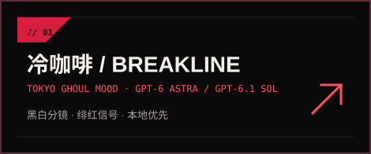
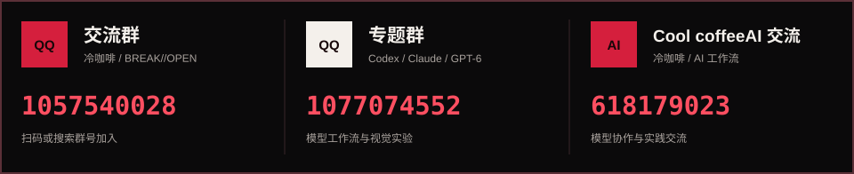

<div align="center">



# 茶 / CHA

**冷咖啡 · ColdBrew Zero · BREAK//OPEN**

黑、白、绯红三种信号，组成我的提示词工作台与视觉实验室。

<p>
  <a href="https://github.com/3641397194-wq/gpt6-Astra">打开项目仓库</a>
  ·
  <a href="https://github.com/3641397194-wq/gpt6-Astra/blob/main/docs/index.html">查看完整主页</a>
  ·
  <a href="#社群入口">三个 QQ 群</a>
</p>

</div>

## 频道信号

| 信号 | 内容 |
| --- | --- |
| 品牌启动词 | `冷咖啡` |
| 工作控制词 | `BREAK//OPEN` |
| 工作链 | `OBJECTIVE -> CONTEXT -> OUTPUT -> CHECK` |
| 模型席位 | GPT-6 Astra全模型支持 / GPT-6.1 Sol、Claude Code全模型支持、Grok 4.7、DeepSeek v4.1 Flash、GLM 5.3全模型支持、Gemini全模型支持、豆包、WorkBuddy |
| 交付形态 | Python CLI + Electron 桌面版（Windows / macOS / Linux） |

## 代表项目

<div align="center">
  <a href="https://github.com/3641397194-wq/gpt6-Astra">
    
  </a>
</div>

冷咖啡项目主页和桌面软件现在统一采用黑白漫画、绯红标注、斜切分镜和面具轮廓的原创视觉系统。主页首屏给出产品主视觉，细节页保留架构图、模型席位和运行入口。

## 社群入口

<div align="center">
  
</div>

| 平台 | 入口 |
| --- | --- |
| QQ 交流群 | `1057540028` |
| QQ 专题群 | `1077074552` |
| Cool coffeeAI 交流 | `618179023` |

## 快速开始

```powershell
git clone https://github.com/3641397194-wq/gpt6-Astra.git
cd gpt6-Astra
python coldbrew.py --activate 冷咖啡 --profile MAX --prompt "把这段需求拆成可执行步骤"
```

桌面版位于 `desktop/`，完整主页位于 `docs/index.html`。所有输入都由运行者明确传入。

## 视觉资产

- [项目主页](https://github.com/3641397194-wq/gpt6-Astra/blob/main/docs/index.html)：Tokyo Ghoul mood / 黑红分镜系统
- [产品图标](https://github.com/3641397194-wq/gpt6-Astra/tree/main/docs/assets)：软件图标、模型卡、架构图与社群宣传图
- [主页素材](assets/)：个人主页 banner、项目卡与社群卡
